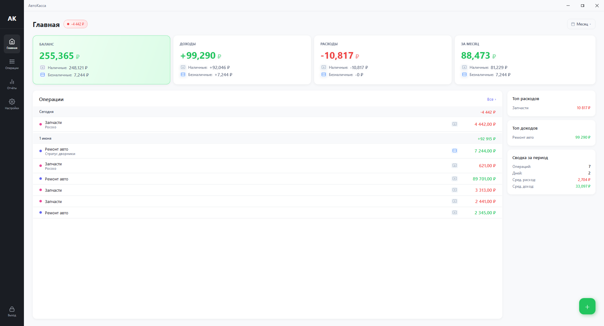
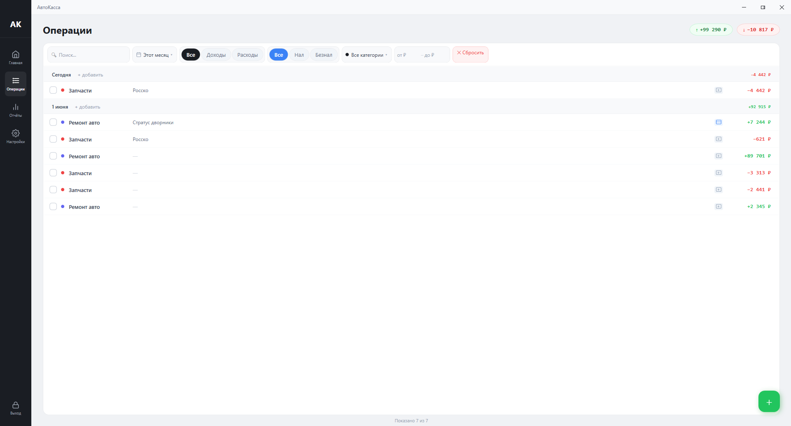
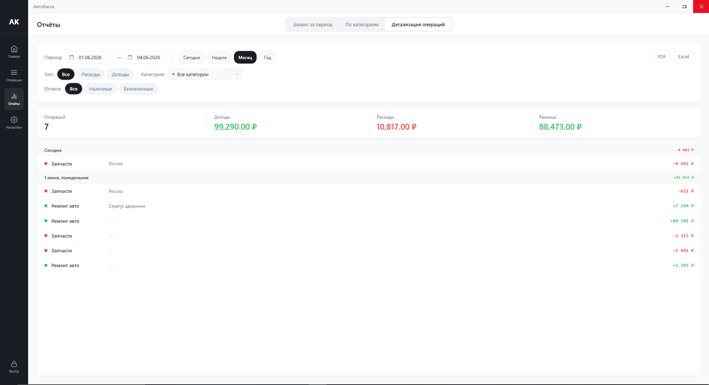

<div align="center">


# 💰 AutoKassa

**Десктопное приложение для учёта финансов автосервиса**

[](https://dotnet.microsoft.com/)
[](https://github.com/dotnet/wpf)
[](https://sqlite.org/)
[]()

</div>

---

## 📋 Описание

**AutoKassa** — это современное WPF-приложение для учёта доходов и расходов автосервиса. Работает полностью локально, без облачных сервисов, хранит данные в SQLite-базе.

- 🔒 Защита паролем с автоблокировкой экрана
- 📊 Наглядный дашборд с ключевыми показателями
- 📁 Экспорт отчётов в PDF и Excel
- 💾 Резервное копирование базы данных
- ⚡ Быстрая работа благодаря локальной SQLite

---

## 🖼️ Скриншоты

### Главный экран (Дашборд)


### Управление операциями


### Отчёты и аналитика


---

## ✨ Возможности

| Модуль | Описание |
|--------|----------|
| **📊 Дашборд** | Сводка баланса, доходов, расходов, топ категорий и последние операции |
| **📝 Операции** | CRUD-операции с фильтрацией, поиском, пагинацией и soft-delete |
| **📂 Категории** | Управление категориями доходов/расходов с цветами и сортировкой |
| **📈 Отчёты** | Баланс за период, структура по категориям, детализация операций |
| **📤 Экспорт** | Выгрузка отчётов в PDF (QuestPDF) и Excel (ClosedXML) |
| **⚙️ Настройки** | Темы, резервное копирование, автоблокировка, экспорт/импорт JSON |
| **🔐 Безопасность** | BCxt-хеширование паролей, секретный вопрос, автоблокировка по таймауту |

---

## 🚀 Быстрый старт

### Портативная версия

1. Скачай `AutoKassa_Portable.zip` из [Releases](../../releases)
2. Распакуй в любую папку
3. Запусти `AutoKassa.exe`

### Сборка из исходников

```bash
# Клонирование репозитория
git clone https://github.com/kommo1337/AutoKassa.git
cd AutoKassa

# Сборка решения
dotnet build

# Запуск приложения
dotnet run --project AutoKassa

# Запуск тестов
dotnet test
```

---

## 🛠️ Технологический стек

| Компонент | Технология |
|-----------|-----------|
| Платформа | .NET 8.0 |
| UI | WPF + XAML |
| ORM | Entity Framework Core 8 |
| База данных | SQLite |
| DI | Microsoft.Extensions.DependencyInjection |
| Графики | OxyPlot.Wpf |
| PDF-экспорт | QuestPDF |
| Excel-экспорт | ClosedXML |
| Хеширование | BCrypt.Net-Next |
| Логирование | Serilog |
| Тестирование | xUnit + FluentAssertions |

---

## 🏗️ Архитектура

Приложение построено на **MVVM** с использованием **Dependency Injection**:

- **Models** — сущности EF Core (`Transaction`, `Category`, `AppSettings`)
- **ViewModels** — бизнес-логика экранов, команды, свойства для биндинга
- **Views** — XAML-разметка (code-behind содержит только UI-логику)
- **Services** — доступ к данным и бизнес-логика

```
AutoKassa/
├── Models/          # Сущности БД и DTO
├── Services/        # Бизнес-логика и доступ к данным
├── ViewModels/      # MVVM ViewModels
├── Views/           # XAML-представления
├── Helpers/         # Конвертеры, команды, базовые классы
└── Migrations/      # EF Core миграции
```

---

## 🧪 Тестирование

```bash
# Все тесты
dotnet test

# Только сервисы
dotnet test --filter "FullyQualifiedName~Services"
```

Тесты используют SQLite in-memory (`:memory:`) с автоматическим созданием seed-данных.

---

## 📦 Структура базы данных

- **Transaction** — финансовые операции (доходы/расходы) с soft delete
- **Category** — категории с цветами, сортировкой и системным флагом
- **AppSettings** — настройки приложения (single-row, Id = 1)

---

## ⚠️ Требования

- Windows 10/11 (x64)
- [.NET 8.0 Desktop Runtime](https://dotnet.microsoft.com/download/dotnet/8.0)

---

<div align="center">

Сделано с ❤️ для автосервисов

</div>
